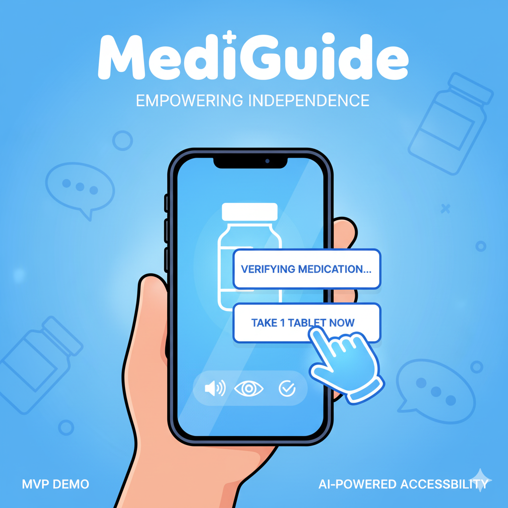
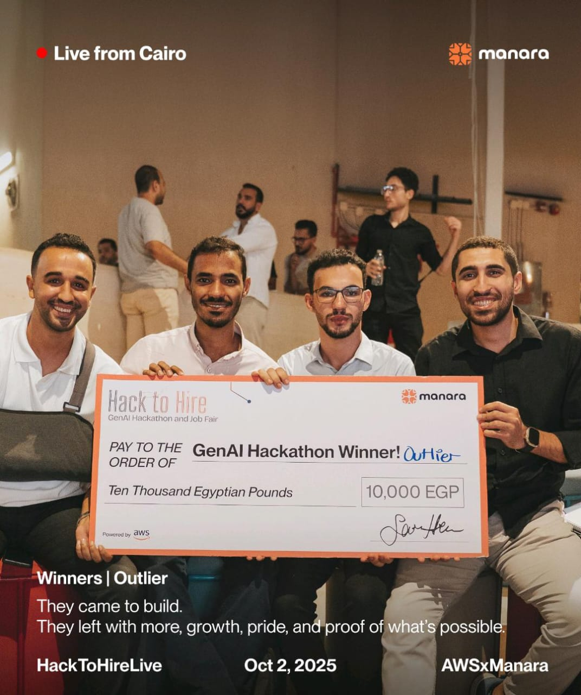
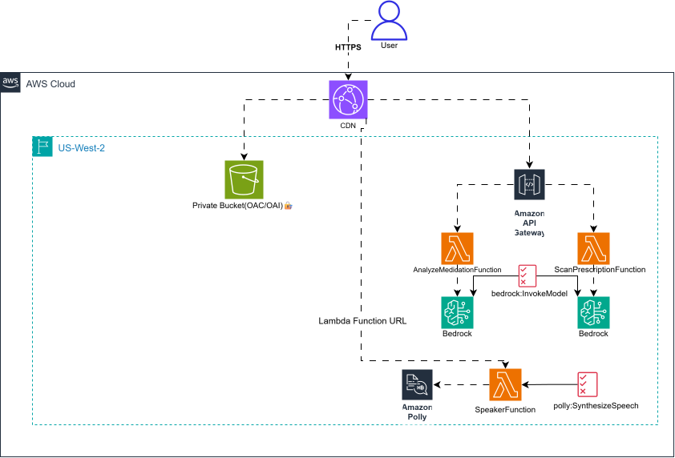

# 🩺 MediGuide – Empowering Accessibility in Healthcare

**MediGuide** is an accessibility-first application designed to empower **blind and low-vision individuals** to manage their medications with confidence, safety, and independence.  
Through the integration of **AI-powered image recognition**, a **voice-first interface**, and a **secure medication verification system**, MediGuide reduces the risk of errors such as taking the wrong medication or incorrect dosage — enhancing trust, autonomy, and quality of life.

This MVP was developed as part of an effort to bridge the gap between **healthcare accessibility** and **modern technology**, with a strong emphasis on usability and inclusivity.  
**The MVP is designed primarily for Arabic-speaking users, featuring a voice-first interface and localized accessibility experience to ensure seamless interaction and understanding for native speakers.**
🎥 **[Watch the Demo Video](https://youtu.be/z5M-RYAIPPc?si=ivBOhDTd_RtAIUOw)** – *A quick walkthrough of MediGuide in action.*
[](https://youtu.be/z5M-RYAIPPc?si=ivBOhDTd_RtAIUOw)

🏆 **Achievement:** Awarded **3rd Place** in the **Manara x AWS "Hack to Hire" Hackathon**, where MediGuide was recognized for its innovation and potential real-world impact.


---

## 🚀 Project Overview

The project follows a **serverless architecture** powered by AWS, ensuring scalability, maintainability, and low operational overhead.  
It is divided into two main components:

- **`frontend/`** – A modern **React + Vite** web application that delivers a clean, responsive, and accessible user experience.  
- **`backend/`** – An **AWS CDK** (Cloud Development Kit) stack that defines the application’s serverless infrastructure, including compute, storage, and APIs.

---

## 🧩 Tech Stack

| Layer | Technologies |
|-------|---------------|
| Frontend | React, Vite, TailwindCSS, TypeScript |
| Backend | AWS Lambda, API Gateway, DynamoDB, S3 |
| Infrastructure | AWS CDK (TypeScript) |
| AI & Recognition | Image-based medicine identification model |
| Accessibility | Voice-first interaction design, screen reader support |




---

## ⚙️ Setup and Installation

### Frontend

1. **Navigate to the frontend directory**
   ```bash
   cd frontend
   ```

2. **Install dependencies**
   ```bash
   npm install
   ```

3. **Run the development server**
   ```bash
   npm run dev
   ```
   The app will be available at [http://localhost:5173](http://localhost:5173)

---

### Backend

1. **Navigate to the backend directory**
   ```bash
   cd backend
   ```

2. **Install dependencies**
   ```bash
   npm install
   ```

3. **Deploy the serverless stack**
   ```bash
   npx cdk deploy
   ```

---

## 🏗️ Building for Production

To build and deploy the frontend as a static website:

1. **Build the frontend**
   ```bash
   npm run build
   ```
   The production files will be generated inside the `dist/` directory.

2. **Deploy to AWS S3**
   ```bash
   aws s3 sync dist/ s3://<your-s3-bucket-name>
   ```
   Replace `<your-s3-bucket-name>` with the bucket created by your CDK deployment.

---

## 💡 Vision and Future Work

While this version represents an **MVP**, MediGuide sets the foundation for a scalable accessibility platform that can integrate with:
- Electronic prescription systems  
- Cloud-based medication databases  
- Multi-language voice assistance  
- AI-driven prescription scanning and personalization  

---

## 👥 Contributors

- **Mostafa Bahaa** – Backend & ML Engineering, System Architecture  
- Collaborators – Frontend & UI Development  

---

## 📬 Feedback & Collaboration

Contributions and feedback are always welcome!  
If you’re interested in accessibility tech, AWS cloud applications, or AI for social good, feel free to open an issue or reach out.
